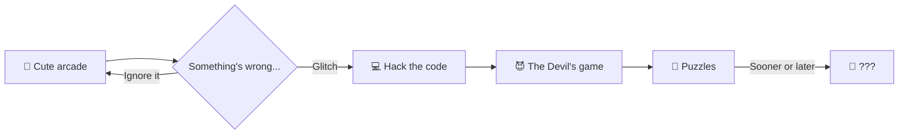

<div align="center">

```
 ██████╗  ██████╗ ███╗   ██╗██╗   ██╗    ██╗███████╗██╗      █████╗ ███╗   ██╗██████╗
 ██╔══██╗██╔═══██╗████╗  ██║╚██╗ ██╔╝    ██║██╔════╝██║     ██╔══██╗████╗  ██║██╔══██╗
 ██████╔╝██║   ██║██╔██╗ ██║ ╚████╔╝     ██║███████╗██║     ███████║██╔██╗ ██║██║  ██║
 ██╔═══╝ ██║   ██║██║╚██╗██║  ╚██╔╝      ██║╚════██║██║     ██╔══██║██║╚██╗██║██║  ██║
 ██║     ╚██████╔╝██║ ╚████║   ██║       ██║███████║███████╗██║  ██║██║ ╚████║██████╔╝
 ╚═╝      ╚═════╝ ╚═╝  ╚═══╝   ╚═╝       ╚═╝╚══════╝╚══════╝╚═╝  ╚═╝╚═╝  ╚═══╝╚═════╝
```

### 🎠 *This is not a game about ponies.* 🔥

**A suspense puzzle game disguised as a cute little arcade.**
You are trapped in limbo — inside a broken, malevolent arcade machine built by the Devil himself.

<br>

[](https://store.steampowered.com/app/405640/Pony_Island/)
[](https://store.steampowered.com/app/405640/Pony_Island/)
[](https://www.metacritic.com/game/pc/pony-island)
[](https://store.steampowered.com/app/405640/Pony_Island/#app_reviews_hash)


<br>

[About](#about) •
[Features](#features) •
[Requirements](#requirements) •
[Credits](#credits) •
[Universe](#universe) •
[Repository](#repository) •
[Contributing](#contributing)

</div>

---

<a id="about"></a>
## 🕹️ About the Game

> ```
> > LOADING PONY_ISLAND.EXE ...
> > WELCOME, PLAYER! LET'S HAVE SOME FUN :)
> > ERR█R: S0UL_LINK EST█BLISHED
> ```

**Pony Island** is an indie game by **Daniel Mullins Games** that starts out as a simple pony runner — and ends up somewhere else entirely.
The Devil hates having his puzzles solved and his sloppy code exposed — and you'll have to do both.
You'll need to think outside the box to move forward, and you'll be insulted every time you do.

|              |                                                   |
| ------------ | ------------------------------------------------- |
| 🎮 **Genre**   | Puzzle · Psychological Horror · Hacking · Meta   |
| 👤 **Developer / Publisher** | Daniel Mullins Games              |
| 📅 **Release date** | January 4, 2016                              |
| ⏱️ **Length** | Short — an evening or two                         |
| 💿 **Platforms** | Windows · macOS · SteamOS / Linux              |
| 🌐 **Website**   | [pony-island.com](http://www.pony-island.com)  |

---

<a id="features"></a>
## ✨ What Awaits You

- 🩸 **Peer behind the rotting curtain** of "Pony Island" and repair its broken code
- 🎠 **Play by the Devil's rules** in his demented game of ponies
- 💾 **Explore the depths** of the cryptic operating system that runs His game
- 🧩 **Hacking puzzles** that shatter the fourth wall
- 🎵 **Atmospheric soundtrack** by Jonah Senzel (available as a separate DLC)
- 🏆 **20 achievements**, trading cards, and Points Shop items on Steam

<details>
<summary>🔒 <b>Tip for newcomers (spoiler-free)</b></summary>

<br>

Go in blind. Don't read guides, don't watch playthroughs.
If something seems broken — maybe it's meant to be. Or maybe your job is to break it even more.

</details>

---

## 🧭 The Player's Journey



---

<a id="requirements"></a>
## ⚙️ System Requirements

<table>
<tr>
<th></th>
<th>🪟 Windows</th>
<th>🍎 macOS</th>
<th>🐧 Linux</th>
</tr>
<tr>
<td><b>OS (min.)</b></td>
<td>Windows XP*</td>
<td>Mac OS X 10.7</td>
<td>Ubuntu 12.04</td>
</tr>
<tr>
<td><b>OS (rec.)</b></td>
<td>Vista / 7 / 8 / 10</td>
<td>Mac OS X 10.7+</td>
<td>Ubuntu 12.04+</td>
</tr>
<tr>
<td><b>RAM</b></td>
<td colspan="3" align="center">2 GB (min.) · 4 GB (rec.)</td>
</tr>
<tr>
<td><b>Graphics</b></td>
<td>DirectX 9.0</td>
<td>—</td>
<td>—</td>
</tr>
<tr>
<td><b>Storage</b></td>
<td colspan="3" align="center">400 MB</td>
</tr>
</table>

<sub>* Since January 1, 2024, the Steam client only supports Windows 10 and later.</sub>

---

## 🌍 Localization

Interface, audio, and subtitles are available in **12 languages**:

🇬🇧 English · 🇷🇺 Русский · 🇫🇷 Français · 🇩🇪 Deutsch · 🇮🇹 Italiano · 🇪🇸 Español ·
🇩🇰 Dansk · 🇹🇷 Türkçe · 🇵🇹 Português · 🇵🇱 Polski · 🇳🇱 Nederlands · 🇨🇳 简体中文

---

<a id="credits"></a>
## 👥 Credits

| Role | Name |
| --- | --- |
| 🧠 Creator | **Daniel Mullins** |
| 🎨 Consulting Designer | Simon Jenkins |
| 🎼 Musician | Jonah Senzel |

<details>
<summary>🌐 Localization team</summary>

<br>

| Language | Translator |
| --- | --- |
| French | @EnzoPiou |
| Italian | FenixTM |
| German | @77pali |
| Spanish | Luis Redin (Fusti) |
| Danish | Kenneth Mohr |
| Portuguese | Alan K. Cirino |
| Turkish | Berke Oğuz Yılmaz |
| Polish | @TomWojcik1 |
| Dutch | Leanne Kiksen |
| Russian | Farhad Alyshev |
| Simplified Chinese | Hex Hanslation Group |

</details>

---

<a id="universe"></a>
## 🃏 The Daniel Mullins Games Universe

Enjoyed Pony Island? The creator has more games that break themselves from the inside:

| Game | In short |
| --- | --- |
| 🎠 **[Pony Island](https://store.steampowered.com/app/405640/Pony_Island/)** | Where it all began |
| 🍺 **[The Hex](https://store.steampowered.com/app/510420/The_Hex/)** | Six heroes, six genres, one tavern |
| 🃏 **[Inscryption](https://store.steampowered.com/app/1092790/Inscryption/)** | A card-based horror roguelike that isn't what it seems |

> 💡 All three games are sold together on Steam in the **Inscryption: Beginner's Deck** bundle.

---

<a id="repository"></a>
## 📁 Repository Structure

```
pony-island-fan-hub/
├── 📄 README.md              ← you are here
├── 📂 guides/                # guides and tips (spoilers clearly marked)
│   ├── achievements.md       # all 20 achievements
│   └── tips-no-spoilers.md
├── 📂 lore/                  # story analysis and theories ⚠️ SPOILERS
├── 📂 fan-art/               # original fan art by contributors
├── 📂 tools/                 # fan-made utilities (no game files included)
├── 📄 CONTRIBUTING.md
└── 📄 LICENSE
```

---

<a id="contributing"></a>
## 🤝 Contributing

1. 🍴 **Fork** the repository
2. 🌿 Create a branch: `git checkout -b feature/my-guide`
3. ✍️ Commit your changes: `git commit -m "Add guide for ..."`
4. 🚀 Push the branch: `git push origin feature/my-guide`
5. 📬 Open a **Pull Request**

**Rules:**
- ⚠️ Always hide spoilers inside `<details>`
- 🚫 No game files, assets, music, or code — original content only
- 💬 Be kind (leave the insults to the Devil)

---

## ⚖️ Disclaimer

This is an **unofficial fan repository**. It is not affiliated with or endorsed by Daniel Mullins Games.
*Pony Island* and all related materials are the property of their respective owners.
Want to play? [Buy the game on Steam](https://store.steampowered.com/app/405640/Pony_Island/) and support the creator. ❤️

---

<div align="center">

```
> DO YOU WANT TO PLAY AGAIN?
> [ YES ]   [ YES ]
```

⭐ **Leave a star if this game left a mark on your soul** ⭐

<sub>Made with 🔥 by fans, for fans</sub>

</div>
